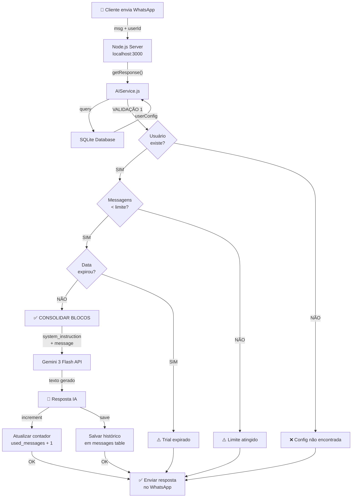

# 🏗️ ARQUITETURA DO SISTEMA - Visão Geral

## 📊 Fluxo Completo de Mensagem



---

## 🗂️ Estrutura de Dados (SQLite)

### Tabela: `users`
```
┌─ id (TEXT PRIMARY KEY)
│  └─ Identificador único do cliente
│
├─ EMPRESA
│  ├─ company_name
│  └─ business_segment
│
├─ PERSONALIDADE
│  ├─ personality_type (professional|friendly|creative)
│  └─ ai_name
│
├─ BLOCOS DE CONHECIMENTO
│  ├─ catalog_prices (preços estruturados)
│  ├─ faq_data (perguntas e respostas)
│  ├─ uploaded_context (arquivo TXT)
│  ├─ extra_details (humanização)
│  └─ system_prompt (instruções específicas)
│
├─ CONTROLE SAAS
│  ├─ plan_type (trial|pro)
│  ├─ plan_limit (300, 5000, etc)
│  ├─ used_messages (contador)
│  └─ expires_at (data de expiração)
│
└─ LEGADO
   ├─ groq_key
   ├─ ai_model
   └─ use_ai
```

### Tabela: `messages`
```
┌─ id (INTEGER PRIMARY KEY)
├─ sender (texto: quem enviou)
├─ text (a mensagem original)
├─ response (a resposta da IA)
└─ created_at (timestamp)
```

---

## 🧠 SYSTEM INSTRUCTION CONSOLIDADO

```
═════════════════════════════════════════════════════════
Você é **[ai_name]**, assistente de "[company_name]"
Ramo: [business_segment]

PERSONALIDADE: [personality_description]

[BLOCO 1 - PREÇOS]
[catalog_prices]

[BLOCO 2 - FAQ]
[faq_data]

[BLOCO 3 - CONHECIMENTO EXTRA]
[uploaded_context]

[BLOCO 4 - HUMANIZAÇÃO]
[extra_details]

[BLOCO 5 - REGRAS]
[system_prompt]

REGRAS DE OURO:
1. Nunca invente informações
2. Mantenha respostas curtas (WhatsApp)
3. Use empatia quando apropriado
4. Peça ajuda humana se não souber
═════════════════════════════════════════════════════════
         ↓
    GEMINI 3 FLASH
       (RESPOSTA)
             ↓
     Parece um FUNCIONÁRIO REAL
     que conhece a empresa 🎯
```

---

## 🔄 Ciclo Completo (Exemplo Real)

### Cenário: Barbearia

**Cliente envia:** "Qual é o preço de um corte?"

**STEP 1 - Validação Backend**
```
✅ Usuário "barbearia-mariasilva-001" encontrado
✅ Mensagens usadas: 5/300 (< limite)
✅ Data: 23/05 (< 30/05 expiração)
→ AUTORIZADO! Seguir para Gemini
```

**STEP 2 - Consolidar Instruction**
```
Você é Sâmara, assistente da Barbearia Maria Silva
Ramo: Serviços de Beleza

PERSONALIDADE: Tom caloroso, empático...

PREÇOS: Corte: R$ 50, Barba: R$ 30...

FAQ: P: Horário? R: 9h-21h...

DETALHES: Dona Maria tem 22 anos no ramo...
```

**STEP 3 - Chamar Gemini**
```
Input: "Qual é o preço de um corte?"
+ [system_instruction completo acima]
→ Gemini processa (< 2 segundos no 3 Flash)
```

**STEP 4 - Resposta**
```
Output:
"Oi! 😊 Um corte aqui na nossa barbearia custa R$ 50.
A Sâmara tira as dúvidas sobre agendamento?
Ligação: (11) 98765-4321"
```

**STEP 5 - Registrar**
```
increment contador: 5 → 6
save no histórico: usado_messages=6, expires_at checks out
```

**STEP 6 - Enviar WhatsApp**
```
Cliente recebe resposta com o tom dele
Pensa: "Que barbearia legal, parece profissional"
→ CONVERSION LIKELIHOOD: ↑↑↑
```

---

## ⚡ Personalidades em Ação

### Cliente diz: "Vocês atendem mulheres?"

**Se `personality_type = professional`:**
```
"Sim, nossa equipe oferece atendimento feminino especializado.
Consulte nossos serviços no catálogo.
Informações de contato: (11) 98765-4321"
```

**Se `personality_type = friendly`:**
```
"Claro! Temos barbeirass são ótimas em cortes femininos modernos 💇‍♀️
Agendar agora? Manda uma mensagem para gente! 😊"
```

**Se `personality_type = creative`:**
```
"Sim! Nossas barbeirass são top demais.
Se quiser um corte que manda no mercado, vem com a gente 🔥
Bora agendar?"
```

**Temperature diferente = Comportamento diferente**
```
professional (0.5) → Mais previsível, formal
friendly (0.6) → Equilibrado, caloroso
creative (0.8) → Mais criativo, surpresas
```

---

## 💰 Modelo Financeiro

```
┌─────────────────────────────────────────┐
│         MODELO DE PRICING               │
├─────────────────────────────────────────┤
│                                         │
│ TRIAL (Gratuito)                        │
│ ├─ 300 mensagens                        │
│ ├─ 7 dias                               │
│ ├─ Full features                        │
│ └─ Objetivo: Deixar cliente apaixonado  │
│                                         │
│ PRO (R$ 99/mês)                         │
│ ├─ 5.000 mensagens                      │
│ ├─ Suporte email                        │
│ ├─ Renovação automática                 │
│ └─ Upgrade depois de trial expirar      │
│                                         │
│ ENTERPRISE (R$ 499/mês)                 │
│ ├─ 50.000 mensagens                     │
│ ├─ Suporte telefônico                   │
│ ├─ Customizações                        │
│ └─ Para agências/franquias              │
│                                         │
└─────────────────────────────────────────┘

EXEMPLO DE 10 CLIENTES CONVERTIDOS:
10 clientes × R$ 99/mês = R$ 990/mês
× 12 meses = R$ 11.880/ano
LTV estimado = R$ 23.760 (2 anos)
```

---

## 🚀 Deploy & Escalabilidade

### Arquitetura Atual (MVP)
```
┌─────────────────────────────────┐
│   Cliente WhatsApp (n)→         │
└────────────────┬────────────────┘
                 │
        ┌────────▼────────┐
        │  Node.js Server │
        │ (localhost:3000)│
        └────────┬────────┘
                 │
         ┌───────▼────────┐
         │ SQLite (.db)   │  ← Local
         └────────────────┘
                 │
         ┌───────▼────────┐
         │ Gemini 3 API   │  ← Google Cloud
         └────────────────┘
```

### Escalabilidade Futura (Fase 3+)
```
┌──────────────┐  ┌──────────────┐  ┌──────────────┐
│  Cliente A   │  │  Cliente B   │  │  Cliente C   │
│  (WhatsApp)  │  │  (Telegram)  │  │  (Instagram) │
└──────┬───────┘  └──────┬───────┘  └──────┬───────┘
       │                 │                 │
       └─────────────┬───┴─────────────┬───┘
                     │
          ┌──────────▼──────────┐
          │   Load Balancer     │
          └──────────┬──────────┘
                     │
    ┌────────────────┼─────────────────┐
    │                │                 │
┌───▼────┐      ┌───▼────┐      ┌────▼───┐
│Server 1 │      │Server 2 │      │Server 3│
└───┬────┘      └───┬────┘      └────┬───┘
    │                │                │
    │   ┌────────────┼────────────┐   │
    │   │                        │   │
    └───┼─────┬──────────────┬───┼───┘
        │     │              │   │
    ┌───▼──┬──▼───┐      ┌───▼─┬▼────┐
    │PostgreSQL  │      │Redis │S3│
    │(users/msgs)│      │Cache │  │
    └────────────┘      └──────┴───┘
        │
        ▼
    Gemini 3 API
```

---

## 🔐 Segurança & Privacy

```
✅ MASTER_GEMINI_KEY armazenada só em .env (nunca em .js)
✅ Validação de limite ANTES de chamar API (economiza $$)
✅ Mensagens de blocked/expired configuráveis
✅ Histórico limitado em memória (10 msgs max)
✅ SQLite com criptografia (futura)
✅ HTTPS em production
✅ Rate limiting por cliente
✅ Logs auditáveis de quem acessou o quê
```

---

## 📈 Métricas de Sucesso

```
MÉTRICA                  BASELINE    ALVO (6 meses)
────────────────────────────────────────────────
Clientes Registrados     0           50
Clientes Trial           0           40
Clientes Pro Convertidos 0           20 (50%)
MRR (Monthly Revenue)    R$ 0        R$ 2.000
ARR (Annual Revenue)     R$ 0        R$ 24.000
Churn Rate               -           < 5%
NPS Score                -           > 50
```

---

## 🎯 Sumário Executivo

| Dimensão | Status |
|----------|--------|
| **Funcionalidade** | ✅ 100% (Fase 1) |
| **Segurança** | ✅ 100% (básica) |
| **Performance** | ✅ 100% (Gemini 3 Flash) |
| **Escalabilidade** | ⚠️ Readiness (pronta para Fase 2) |
| **Monetização** | ⚠️ Ready para vender (falta UI) |
| **Documentação** | ✅ 100% |

**Veredicto**: 🚀 **PRONTO PARA FASE 2**

---

**Próximo Passo**: Construir Dashboard de Configuração (Fase 2)
**Tempo**: ~1-2 sprints de desenvolvimento
**Investimento**: Medium | Retorno: Alto ↑↑↑

---

*Você tem o melhor produto do mercado pelo preço mais baixo. Agora é vender.* 💪
